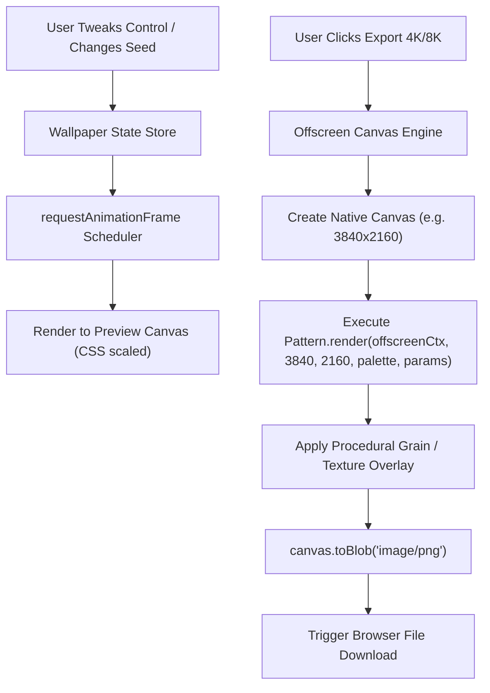

# Architecture Documentation — Wallogen

## 1. System Overview & Technology Stack

Wallogen is built as a unified, client-rendered web application using Next.js (App Router), TypeScript, and Tailwind CSS. The core wallpaper generation engine relies on native **HTML5 Canvas 2D APIs** and **OffscreenCanvas** for high-performance, high-resolution rendering without third-party heavy graphic library overhead.

```
+-----------------------------------------------------------------------------------+
|                                 Next.js (App Router)                              |
+-----------------------------------------------------------------------------------+
|  Landing Page (SEO & Marketing)       |          Wallpaper Generator App          |
|  - Hero & Live Canvas Preview         |  - Controls Panel (Pattern, Palette, Seed)|
|  - Feature Cards & Pattern Gallery    |  - Interactive Canvas Preview Viewport    |
|  - FAQ Accordion                      |  - Device Frame Mockup Manager            |
|  - Creator Support (Buy Me a Coffee)  |  - High-Res Export Engine (4K / 8K)       |
+---------------------------------------+-------------------------------------------+
|                          Shared State & Core Libraries                            |
|  - Pattern Engine Registry   - Palette System   - Canvas Exporter   - Device Specs  |
+-----------------------------------------------------------------------------------+
```

### Key Technical Choices
* **Framework:** Next.js (App Router) with TypeScript for SSR landing page performance + client-side App interactivity.
* **Styling:** Tailwind CSS + Radix UI primitives / Lucide Icons for clean, accessible UI components.
* **Rendering Engine:** HTML5 2D Context (`CanvasRenderingContext2D`) with procedural noise algorithms (`SimplexNoise` / `Perlin` / Canvas ImageData noise buffers).
* **State Management:** Lightweight React State / Zustand store managing pattern parameters, active palette, resolution, and seed.

---

## 2. Core Subsystem Architecture

### 2.1. Pattern Rendering Engine (`/src/lib/engine`)
The rendering engine uses a plugin-based strategy pattern. Every wallpaper design implements a unified `WallpaperPattern` interface:

```typescript
export interface Palette {
  id: string;
  name: string;
  mode: 'light' | 'dark';
  background: string;
  colors: string[];
}

export interface PatternParams {
  seed: number;
  scale: number;
  density: number;
  complexity: number;
  noiseIntensity: number;
  rotation: number;
  customOptions?: Record<string, number | string | boolean>;
}

export interface WallpaperPattern {
  id: string;
  name: string;
  description: string;
  category: 'minimal' | 'gradient' | 'geometric' | 'abstract';
  defaultParams: PatternParams;
  render: (
    ctx: CanvasRenderingContext2D,
    width: number,
    height: number,
    palette: Palette,
    params: PatternParams
  ) => void;
}
```

### 2.2. Rendering Data Flow



### 2.3. Resolution & Device Preset Engine (`/src/lib/devices`)
To ensure wallpapers render sharply across all screens, Wallogen separates **Preview Resolution** from **Export Target Resolution**:

* **Viewport Canvas:** Renders at fixed aspect ratio bounded by the container element dimensions (e.g., 800x450 preview) for maximum FPS during slider tweaks.
* **Export Canvas:** Instantiates a detached offscreen canvas at full target resolution (`3840×2160`, `1290×2796`, etc.) and renders the exact pattern math scaled to target width/height.

### 2.4. Palette Engine (`/src/lib/palettes`)
Provides curated color combinations and utilities:
* Light / Dark variant filtering.
* Color interpolation (lerp) for smooth gradients.
* Seeded random palette generator.
* Custom user palette manager.

---

## 3. Directory Structure

```
wallogen/
├── public/
│   ├── favicon.ico
│   ├── og-image.png
│   └── mockups/              # Device frames (Desktop, iPhone, Tablet)
├── src/
│   ├── app/
│   │   ├── layout.tsx        # Root layout, fonts, SEO metadata
│   │   ├── page.tsx          # Landing page showcasing app & how it works
│   │   └── generate/
│   │       └── page.tsx      # Main Wallpaper Generator Application
│   ├── components/
│   │   ├── landing/          # Landing page components
│   │   │   ├── Hero.tsx
│   │   │   ├── Features.tsx
│   │   │   ├── Gallery.tsx
│   │   │   ├── FAQ.tsx
│   │   │   └── BuyMeACoffee.tsx
│   │   ├── generator/        # Generator app components
│   │   │   ├── CanvasViewport.tsx
│   │   │   ├── ControlsPanel.tsx
│   │   │   ├── PatternPicker.tsx
│   │   │   ├── PaletteSelector.tsx
│   │   │   ├── ResolutionPicker.tsx
│   │   │   └── ExportModal.tsx
│   │   └── ui/               # Shared reusable UI primitives (Buttons, Sliders, Modals)
│   ├── lib/
│   │   ├── engine/           # Pattern registry & render algorithms
│   │   │   ├── index.ts
│   │   │   ├── patterns/
│   │   │   │   ├── waves.ts
│   │   │   │   ├── gradients.ts
│   │   │   │   ├── meshGradients.ts
│   │   │   │   ├── arcs.ts
│   │   │   │   └── topography.ts
│   │   │   └── noise.ts      # Grain / noise post-processor
│   │   ├── palettes/         # Color palettes database & helpers
│   │   ├── devices.ts        # Screen resolutions & device presets
│   │   └── store.ts          # Application state store
│   └── types/                # Shared TypeScript definitions
├── PRD.md
├── ARCHITECTURE.md
├── ARCHITECTURE-ESSENTIALS.md
├── AGENTS.md
├── next.config.mjs
├── tailwind.config.ts
└── tsconfig.json
```

---

## 4. Performance & Export Architecture

1. **Resolution Independence:** All pattern math uses relative coordinates ($x / \text{width}$, $y / \text{height}$) or scaled stroke widths relative to canvas diagonal so pattern proportion remains consistent whether rendered at 800px or 7680px.
2. **Noise Overlay Optimization:** Noise textures use pre-computed small noise tiles or deterministic pseudo-random generators to avoid heavy `getImageData` performance bottlenecks on high-DPI canvases.
3. **Zero-Server Dependencies:** Complete app runs client-side, making deployment cost-free on Vercel / GitHub Pages / Cloudflare Pages.
